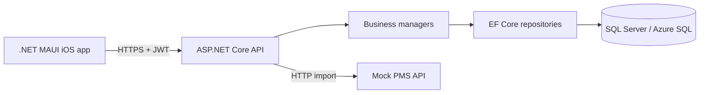

# StayHub

StayHub is an API-first hospitality management and integration platform. It
provides a .NET MAUI application for managing properties, guests, users, and
reservations backed by an ASP.NET Core API and SQL Server.

The project is a production-oriented learning system: the current MVP runs on
a physical iPhone and stores its data in Azure.

## Current MVP

- JWT authentication with Admin, Receptionist, and Viewer roles
- Property, guest, source, user, and reservation workflows
- Reservation search, filtering, sorting, and server-side pagination
- Reservation validation and Admin-only deletion
- Idempotent reservation synchronization from a deterministic Mock PMS
- Synchronization history with conflict and failure reporting
- Read-only AI assistant that answers reservation questions in Russian or German
- Deterministic demonstration data
- Liveness and database-readiness health checks
- Native .NET MAUI client for iOS
- Containerized API deployed to Azure Container Apps
- Azure SQL Database persistence

<p align="center">
  
</p>

## Architecture



The solution follows explicit layer boundaries:

| Project | Responsibility |
| --- | --- |
| `StayHub.Mobile` | MAUI user interface and API clients |
| `StayHub.Api` | HTTP endpoints, authentication, authorization, and composition |
| `StayHub.Business` | Business rules, validation, and managers |
| `StayHub.Contracts` | API request and response models |
| `StayHub.Dal` | EF Core context, repositories, and migrations |
| `StayHub.Domain` | Domain entities and enums |
| `StayHub.Mapping` | Explicit domain/contract mapping |

See [the architecture documentation](docs/ARCHITECTURE.md) for more detail.

## Run locally

### Requirements

- .NET 10 SDK
- Docker Desktop
- For iOS: macOS, Xcode, the .NET MAUI iOS workload, and Rider or another
  MAUI-capable IDE

Start the local SQL Server from the repository root:

```bash
docker compose up -d
```

Configure the development administrator password without committing it:

```bash
dotnet user-secrets set SeedAdmin:Password '<your-password>' \
  --project src/StayHub.Api
```

Run the API:

```bash
dotnet run --project src/StayHub.Api
```

Swagger is available locally at
[`http://localhost:5071/swagger`](http://localhost:5071/swagger). Pending EF
Core migrations and deterministic development seed data are applied during
startup.

The MAUI app is in `src/StayHub.Mobile`. A Debug build reads
`Configuration/appsettings.Development.json` and connects to the local API.
Select an iOS simulator and run `StayHub.Mobile` from Rider.

Stop the local database with:

```bash
docker compose down
```

### Integration tests

Keep Docker Desktop running, then execute:

```bash
dotnet run --project tests/StayHub.Api.IntegrationTests
```

The test suite starts one temporary SQL Server container, runs the real StayHub
API against it, resets the database between tests, and removes the container
when finished. It does not connect to the Azure API or Azure SQL Database.

### Continuous integration

GitHub Actions runs the backend build, unit tests, and Docker-based integration
tests for pull requests targeting `develop`. Repeated pushes cancel an older run
for the same pull request. The workflow uses GitHub-hosted runner and Docker
resources only; it does not connect to or deploy anything in Azure.

The MAUI iOS project is intentionally excluded because the backend workflow
runs on Linux and does not have Xcode or the iOS workload. Mobile builds remain
a separate local validation step for now.

### Local AI assistant

The development AI provider is [Ollama](https://ollama.com/), so local chat does
not consume Azure resources or require a paid API key. Install Ollama and
download the multilingual model once:

```bash
brew install ollama
ollama pull qwen3:4b
```

Start Ollama in a separate terminal before running the StayHub API:

```bash
ollama serve
```

Open **Assistant** in the MAUI app and ask a question in Russian or German. The
API gives the model a read-only snapshot of up to 100 reservations and asks it
to answer in the language of the latest question. Guest email addresses and
phone numbers are not sent to the model. The model never connects directly to
SQL Server and cannot modify StayHub data.

The assistant is enabled in Development and disabled in Production by default.
Production can use Azure AI Foundry after its endpoint, deployment name, and
secret API key are configured. StayHub limits response length and the daily
number of assistant requests. See
[Azure deployment](docs/AZURE_DEPLOYMENT.md#azure-ai-foundry-assistant).

## Azure deployment

The portfolio environment uses this flow:

```text
iPhone → Azure Container Apps → Azure SQL Database
```

A Release build of the MAUI app reads
`Configuration/appsettings.Production.json` and connects to the Azure API.
Use Release when running the application on a provisioned physical iPhone.

- API: Azure Container Apps Consumption, scaled from zero to one replica
- Container image: Azure Container Registry
- Database: Azure SQL Database, serverless free offer with overage disabled
- Secrets: Container App secrets exposed to ASP.NET Core as environment
  variables
- Diagnostics: `/health/live` and `/health/ready`
- Production Swagger and demo seeding: disabled

The first request can take a few seconds while the application scales from
zero. Swagger can be enabled temporarily through the Container App
configuration when an API demonstration is required.

### Wake up Azure services

Open these links on a phone and wait for a response before signing in:

- [API readiness (API and database)](https://stayhub-api.icyforest-8c1312c9.germanywestcentral.azurecontainerapps.io/health/ready)
- [API liveness](https://stayhub-api.icyforest-8c1312c9.germanywestcentral.azurecontainerapps.io/health/live)
- [Mock PMS liveness](https://stayhub-mockpms.icyforest-8c1312c9.germanywestcentral.azurecontainerapps.io/health/live)
- [Mock PMS reservations](https://stayhub-mockpms.icyforest-8c1312c9.germanywestcentral.azurecontainerapps.io/api/reservations)

The same checks from a terminal:

```bash
curl -i "https://stayhub-api.icyforest-8c1312c9.germanywestcentral.azurecontainerapps.io/health/ready"
curl -i "https://stayhub-api.icyforest-8c1312c9.germanywestcentral.azurecontainerapps.io/health/live"
curl -i "https://stayhub-mockpms.icyforest-8c1312c9.germanywestcentral.azurecontainerapps.io/health/live"
curl -sS "https://stayhub-mockpms.icyforest-8c1312c9.germanywestcentral.azurecontainerapps.io/api/reservations"
```

Deployment configuration, required environment variables, and operational
notes are documented in [Azure deployment](docs/AZURE_DEPLOYMENT.md).
Copy-and-paste commands for local startup, health checks, API requests,
synchronization, and Azure operations are in the [operations
runbook](docs/RUNBOOK.md).

## Security

Production database credentials, the JWT signing key, and the seeded Admin
password are not stored in Git. Local development uses a disposable SQL Server
container and an intentionally non-production database password. Use .NET
user-secrets locally and Azure Container App secrets in the cloud.

## Documentation

- [Architecture](docs/ARCHITECTURE.md)
- [Authentication](docs/authentication.md)
- [Domain model](docs/domain.md)
- [UI terminology](docs/UI_TERMINOLOGY.md)
- [Operations dashboard](docs/OPERATIONS_DASHBOARD.md)
- [Operations runbook](docs/RUNBOOK.md)
- [Azure deployment](docs/AZURE_DEPLOYMENT.md)
- [Reservation synchronization](docs/SYNCHRONIZATION.md)
- [Synchronization transaction ADR](docs/adr/0001-synchronization-transaction-boundaries.md)
- [Reservation concurrency ADR](docs/adr/0002-reservation-optimistic-concurrency.md)
- [Roadmap](docs/roadmap.md)
