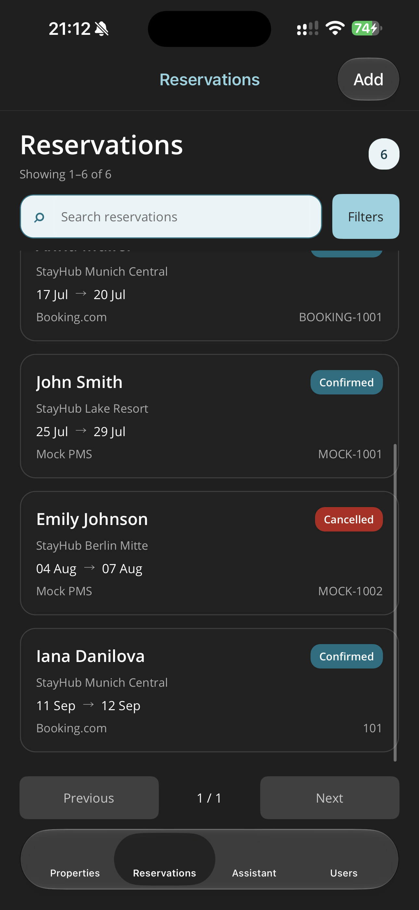
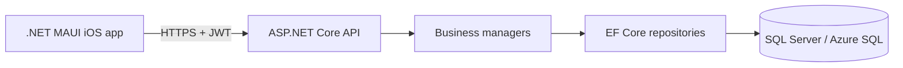

# StayHub

StayHub is an API-first hospitality management and integration platform. It
provides a .NET MAUI application for managing properties, guests, users, and
reservations backed by an ASP.NET Core API and SQL Server.

The project is a production-oriented learning system: the current MVP runs on
a physical iPhone and stores its data in Azure.

## Current MVP

- JWT authentication with Admin, Receptionist, and Viewer roles
- Property, guest, source, user, and reservation workflows
- Reservation search, filtering, sorting, and server-side pagination
- Reservation validation and Admin-only deletion
- Deterministic demonstration data
- Liveness and database-readiness health checks
- Native .NET MAUI client for iOS
- Containerized API deployed to Azure Container Apps
- Azure SQL Database persistence

<p align="center">
  
</p>

## Architecture



The solution follows explicit layer boundaries:

| Project | Responsibility |
| --- | --- |
| `StayHub.Mobile` | MAUI user interface and API clients |
| `StayHub.Api` | HTTP endpoints, authentication, authorization, and composition |
| `StayHub.Business` | Business rules, validation, and managers |
| `StayHub.Contracts` | API request and response models |
| `StayHub.Dal` | EF Core context, repositories, and migrations |
| `StayHub.Domain` | Domain entities and enums |
| `StayHub.Mapping` | Explicit domain/contract mapping |

See [the architecture documentation](docs/ARCHITECTURE.md) for more detail.

## Run locally

### Requirements

- .NET 10 SDK
- Docker Desktop
- For iOS: macOS, Xcode, the .NET MAUI iOS workload, and Rider or another
  MAUI-capable IDE

Start the local SQL Server from the repository root:

```bash
docker compose up -d
```

Configure the development administrator password without committing it:

```bash
dotnet user-secrets set SeedAdmin:Password '<your-password>' \
  --project src/StayHub.Api
```

Run the API:

```bash
dotnet run --project src/StayHub.Api
```

Swagger is available locally at
[`http://localhost:5071/swagger`](http://localhost:5071/swagger). Pending EF
Core migrations and deterministic development seed data are applied during
startup.

The MAUI app is in `src/StayHub.Mobile`. A Debug build reads
`Configuration/appsettings.Development.json` and connects to the local API.
Select an iOS simulator and run `StayHub.Mobile` from Rider.

Stop the local database with:

```bash
docker compose down
```

## Azure deployment

The portfolio environment uses this flow:

```text
iPhone → Azure Container Apps → Azure SQL Database
```

A Release build of the MAUI app reads
`Configuration/appsettings.Production.json` and connects to the Azure API.
Use Release when running the application on a provisioned physical iPhone.

- API: Azure Container Apps Consumption, scaled from zero to one replica
- Container image: Azure Container Registry
- Database: Azure SQL Database, serverless free offer with overage disabled
- Secrets: Container App secrets exposed to ASP.NET Core as environment
  variables
- Diagnostics: `/health/live` and `/health/ready`
- Production Swagger and demo seeding: disabled

The first request can take a few seconds while the application scales from
zero. Swagger can be enabled temporarily through the Container App
configuration when an API demonstration is required.

Deployment configuration, required environment variables, and operational
notes are documented in [Azure deployment](docs/AZURE_DEPLOYMENT.md).

## Security

Production database credentials, the JWT signing key, and the seeded Admin
password are not stored in Git. Local development uses a disposable SQL Server
container and an intentionally non-production database password. Use .NET
user-secrets locally and Azure Container App secrets in the cloud.

## Documentation

- [Architecture](docs/ARCHITECTURE.md)
- [Authentication](docs/authentication.md)
- [Domain model](docs/domain.md)
- [Azure deployment](docs/AZURE_DEPLOYMENT.md)
- [Roadmap](docs/roadmap.md)
