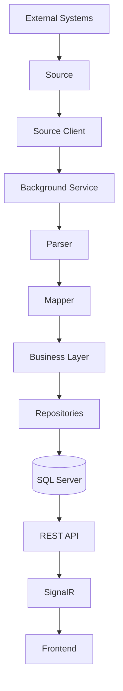
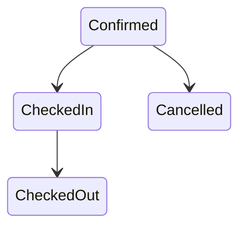
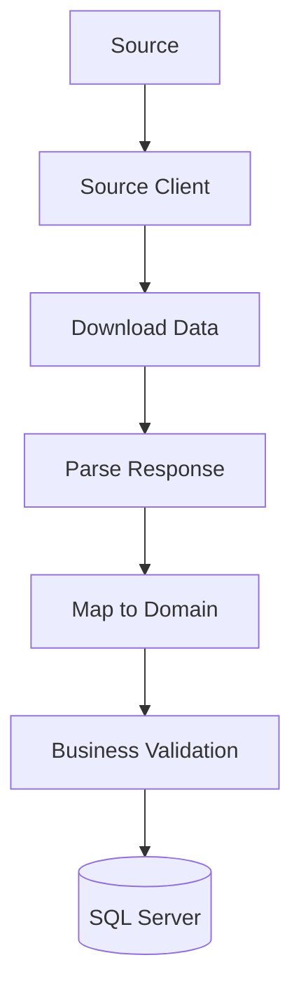

# StayHub Architecture

## Overview

StayHub is an **API-first hospitality integration platform** built with **ASP.NET Core**.

Its purpose is to synchronize **reservations**, **guests**, **properties**, and related data from external Property Management Systems (PMS), booking providers, and other hospitality services into a unified domain model.

The project is designed as a learning platform for modern backend architecture and mirrors many concepts used in real-world products such as **Apaleo**.

---

# High-Level Architecture



---

# Solution Structure

```
StayHub
│
├── StayHub.Api
├── StayHub.Business
├── StayHub.Contracts
├── StayHub.Dal
├── StayHub.Domain
├── StayHub.Mapping
│
├── tests
└── wiki
```

Each project has a single responsibility.

| Project | Responsibility |
|---------|----------------|
| **Api** | Controllers, Authentication, Dependency Injection |
| **Business** | Business logic, Managers, Validation |
| **Contracts** | DTOs used by the API |
| **Dal** | Entity Framework Core, Repositories, Migrations |
| **Domain** | Domain entities and enums |
| **Mapping** | Mapping between Domain and DTOs |

---

# Core Domain

## Property

Represents a hotel, apartment, or accommodation.

Examples

- Hotel
- Hostel
- Apartment
- Vacation Home

---

## Guest

Represents a customer.

Examples

- John Smith
- Max Mustermann

A guest may have multiple reservations.

---

## Reservation

Represents a booking.

Every reservation belongs to exactly one:

- Property
- Guest

Current lifecycle:



Reservations may be cancelled before arrival.

---

## Source

A **Source** describes where reservation data originates.

Examples

- Mock Source
- Apaleo
- Booking.com
- CSV Import
- REST API
- Webhook

A Source **never performs synchronization itself**.

It only describes the integration.

---

# Reservation Synchronization Pipeline



---

# Authentication

Current implementation

- JWT Bearer Authentication
- Role-based Authorization
- Policy-based Authorization
- Swagger JWT Support

Planned

- Keycloak
- OAuth 2.0
- OpenID Connect
- Refresh Tokens

---

# Architectural Principles

## Modular Monolith First

StayHub intentionally starts as a **modular monolith**.

Modules are clearly separated into:

- Api
- Business
- Contracts
- Dal
- Domain
- Mapping

Microservices should only be introduced when clear module boundaries exist.

---

## Clean Layering

```text
API
 ↓
Business
 ↓
DAL
 ↓
Database
```

The Business layer never depends on ASP.NET Core.

---

## DTOs Everywhere

Controllers never expose Entity Framework entities.

All communication happens through **Contracts (DTOs)**.

---

## Repository Pattern

Database access is isolated from business logic.

Repositories are responsible only for persistence.

---

## Business Layer

Business rules belong inside **Managers**.

Examples:

- Reservation status transitions
- Guest validation
- Duplicate reservation detection
- Property validation

---

# Current Features

- JWT Authentication
- Role-based Authorization
- Policy-based Authorization
- Property CRUD
- Guest CRUD
- Reservation CRUD
- Reservation Status Workflow
- EF Core Migrations
- Swagger Integration
- SQL Server
- Central Package Management

---

# Planned Roadmap

## Phase 1 ✅

- Solution architecture
- Property CRUD
- Reservation CRUD
- Guest CRUD

---

## Phase 2

### Source Integrations

- Mock Source
- CSV Import
- JSON Import

---

## Phase 3

### Background Synchronization

- HostedService
- Source Scheduler
- Reservation Import

---

## Phase 4

### SignalR

Real-time reservation updates.

---

## Phase 5

### Webhooks

- Idempotency
- Event History
- Retry Handling

---

## Phase 6

### Testing

- Unit Tests
- Integration Tests
- API Tests

---

## Phase 7

### Identity

- Keycloak
- OAuth 2.0
- OpenID Connect
- Refresh Tokens

---

## Phase 8

### Apaleo Sandbox

Synchronize reservations against a real PMS.

---

## Phase 9

### Messaging

- RabbitMQ
- Outbox Pattern
- Background Processing

---

## Phase 10

### Cloud

- Docker
- Docker Compose
- Azure
- CI/CD
- Kubernetes (optional)

---

# Long-Term Vision

StayHub is not intended to be just another CRUD application.

The goal is to build a production-style backend demonstrating modern .NET engineering practices:

- Clean Architecture
- Modular Monolith
- Background Processing
- External Integrations
- Authentication & Authorization
- Event-Driven Communication
- Real-Time Updates
- Cloud-Native Deployment

The project should resemble the architecture used by modern hospitality platforms such as **Apaleo**, while remaining simple enough to understand, extend, and showcase during technical interviews.
